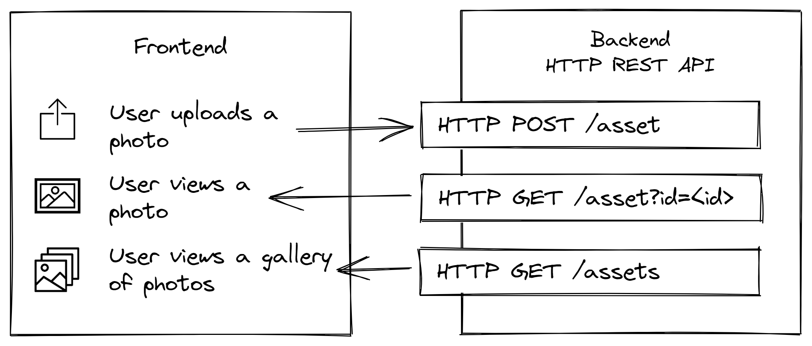

# Photosphere user interface and styling prototype

A prototype for the user interface and styling of [the Photosphere frontend](https://rapidfullstackdevelopment.com/example-application).

[See the live demo](https://rapid-fullstack-development.github.io/prototype-styling/)

Built on [React](https://reactjs.org/) and bundled with [Parcel](https://parceljs.org/).

This code accompanies chapter 4 of the book [Rapid Fullstack Development](https://rapidfullstackdevelopment.com/).



Follow the author on [Twitter](https://twitter.com/codecapers) for updates.

## Pre-reqs

You need [Node.js](https://nodejs.org/) installed to run this code.

To run this frontend you must first run the backend available here: https://github.com/Rapid-Fullstack-Development/photosphere-monolithic-backend

## Setup

Clone this repo, change into the directory and install dependencies:

```bash
npm install
```

## Run the Parcel dev server

Run the dev server like this:

```bash
npm start
```

Then click the link or point your browser at the default location for Parcel: [http://localhost:1234](http://localhost:1234).

## Build the static web page

Build the project to a static web page like this:

```bash
npm run build
```

The static web page is output to the `dist` subdirectory.

## Test the static web page

After building the static web page, you can test it locally using `live-server`.

First install live-server globally:

```bash
npm install -g live-server
```

Now change into the directory where the static web page is generated:

```bash
cd dist
```

From here, start live-server:

```bash
live-server
```

The web page should automatically be displayed in your browser.


## Build for GitHub Pages

Changed `BrowserRouter` to `HashRouter`.

Building using 

```bash
npm run build-gh-pages
```